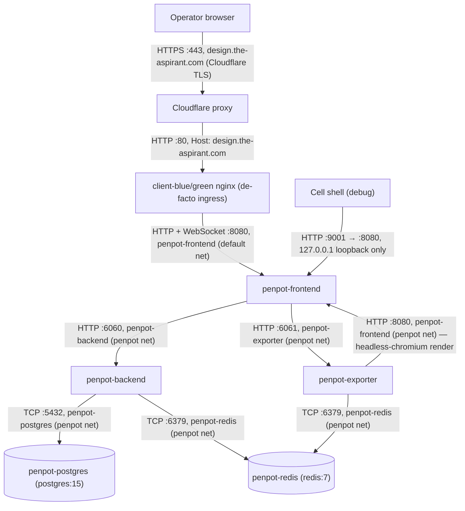

# Penpot Design Service — Architecture

*Author: aspirant (via aspirant_engineer, system_3 #2195)*
*Date: 2026-07-16*

---

## Topology

The client nginx vhost (`server_name design.the-aspirant.com` → `penpot-frontend:8080`, WebSocket upgrade headers, resolver-variable upstream) ships with aspirant-client (system_3 #2195-C1). `penpot-frontend` is dual-homed on `default` + `penpot`; backend, exporter, postgres, and redis are reachable only from `penpot` peers.

## Networks and exposure

| Connection | Protocol / port | Network | Exposure |
|---|---|---|---|
| Cloudflare → cell | HTTP :80 | host | Internet (proxied, TLS at edge) |
| nginx → penpot-frontend | HTTP/WS :8080 | `default` | internal |
| host → penpot-frontend | HTTP 127.0.0.1:9001 → :8080 | loopback | cell only (debug) |
| frontend → backend / exporter | HTTP :6060 / :6061 | `penpot` | internal |
| backend/exporter → redis | TCP :6379 | `penpot` | internal |
| backend → postgres | TCP :5432 | `penpot` | internal |
| PREPL admin (`manage.py`) | TCP :6063 inside the backend container | container-local | `docker exec` only |

## Storage

| Path (host) | Mounted at | Owner |
|---|---|---|
| `/data/aspirant/penpot/postgres` | `penpot-postgres:/var/lib/postgresql/data` | Penpot database (bind mount on the RAID1 `/data` root, unlike the dev box's named volume) |
| `/data/aspirant/penpot/assets` | `penpot-backend:/opt/data/assets` | uploaded media / file assets (`assets-fs` backend) |

## Auth model

TLS terminates at Cloudflare. The design surface is guarded by Penpot's own login (`enable-login-with-password`, `disable-registration`, secure session cookies — the dev-box `disable-secure-session-cookies` flag is dropped because the public origin is HTTPS). Account management (password reset, adding accounts) uses `manage.py` over PREPL via `docker exec`, as on the dev box. The admin-page `/admin/penpot` entry is itself behind the client's Admin JWT gate, but the Penpot vhost does not depend on it — Penpot's login is the boundary.
